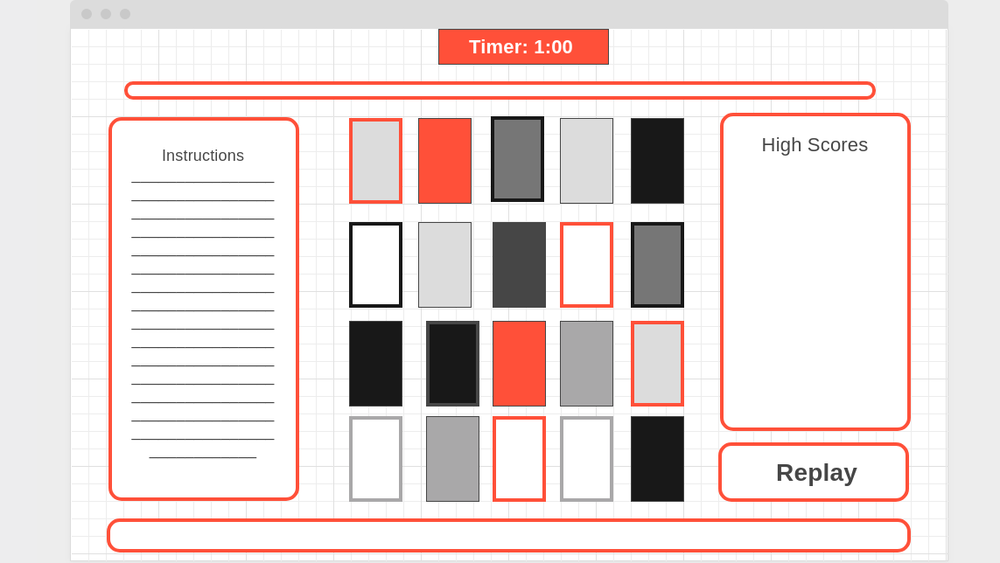

## **Memory Card Game**
---
Cards - Mercury, Venus, Earth, Mars, Jupiter, Saturn, Uranus, Neptune, Pluto 

---

## **Deployed Link**

https://lilymbest.github.io/Unit-1-Project/

---
## **Psuedocode**
---

Create a 4 x 5 game board with 20 cards total that on the page load shows the backs of the all the cards

Add a timer that counts down as the player is matching cards that pauses the page after the time is up

Create a match function based on the planet id of the card

Randomly shuffle the cards each time the game starts

---
## **Stretch Goals**

Add players score on the side score board after each game

Make the cards animate as the flip

Make the timer flash when it hits zero

Make the start button referesh the game

---

## **User Stories**
---
User wants the cards to flip back over when the two cards aren't a match

User would like to be able to replay the game and have the cards be in a different place each time